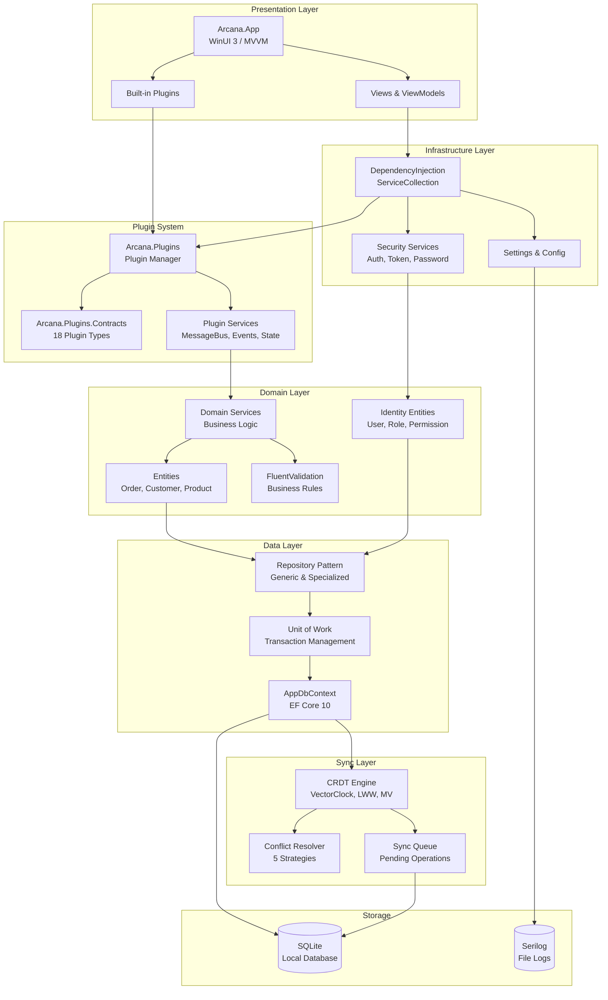
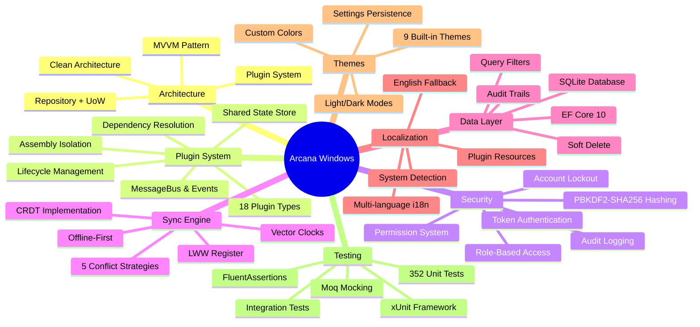
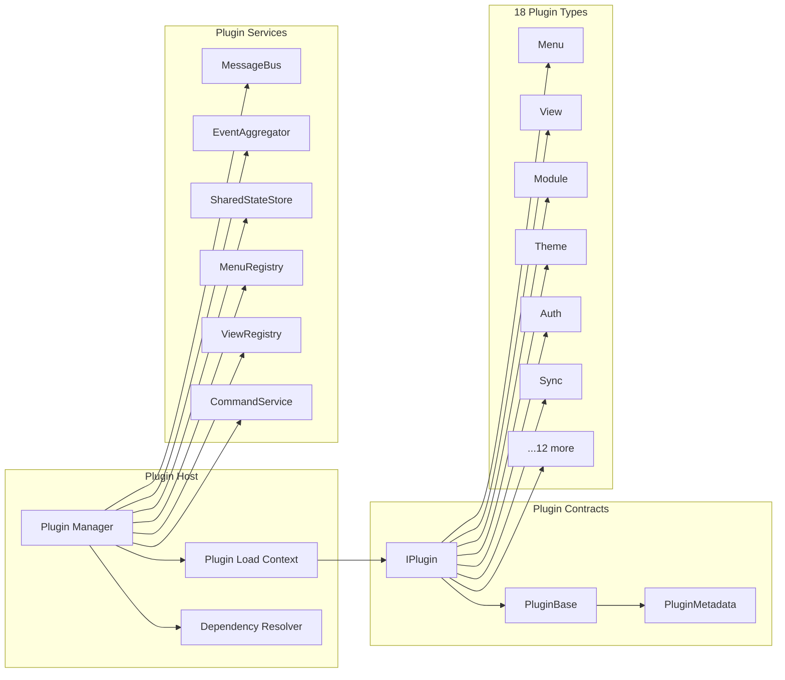
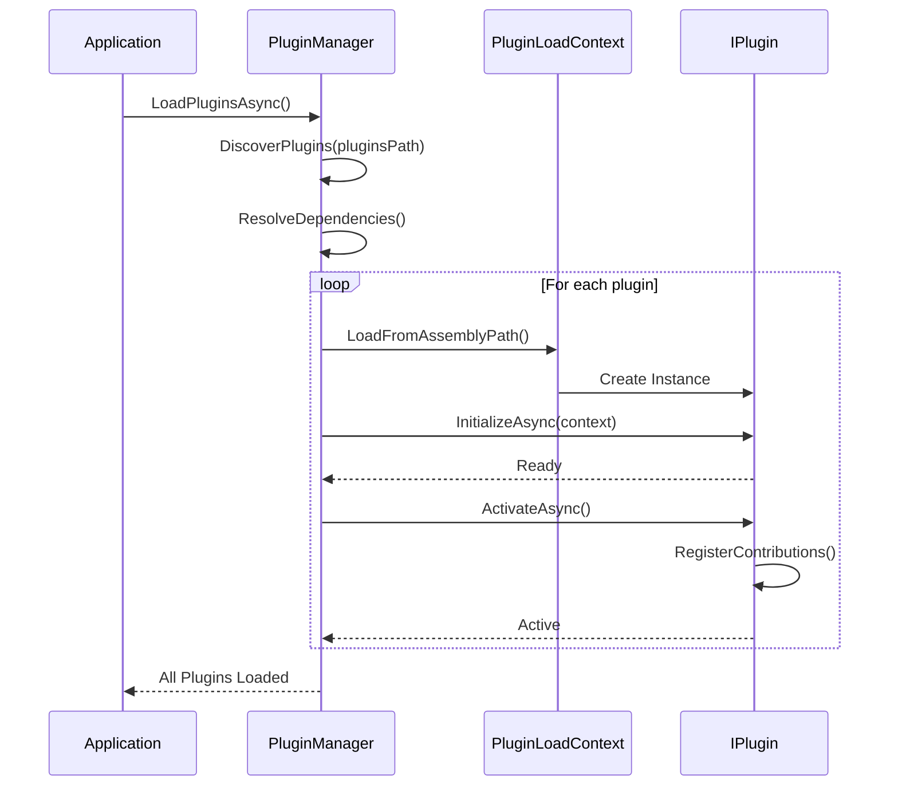
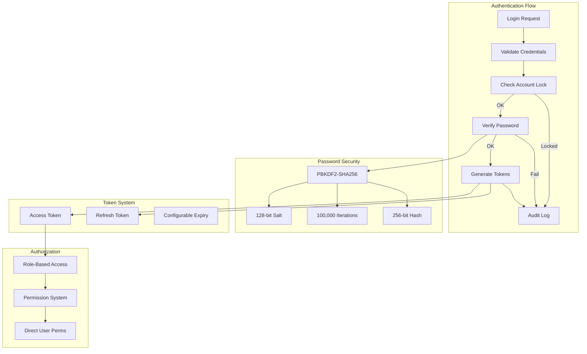
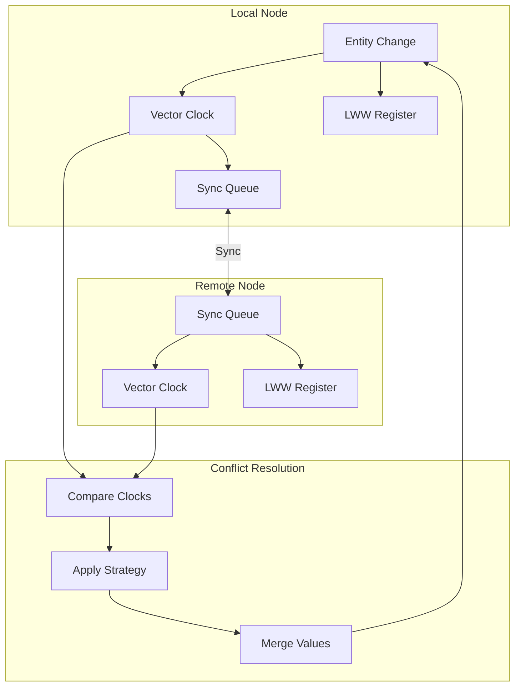
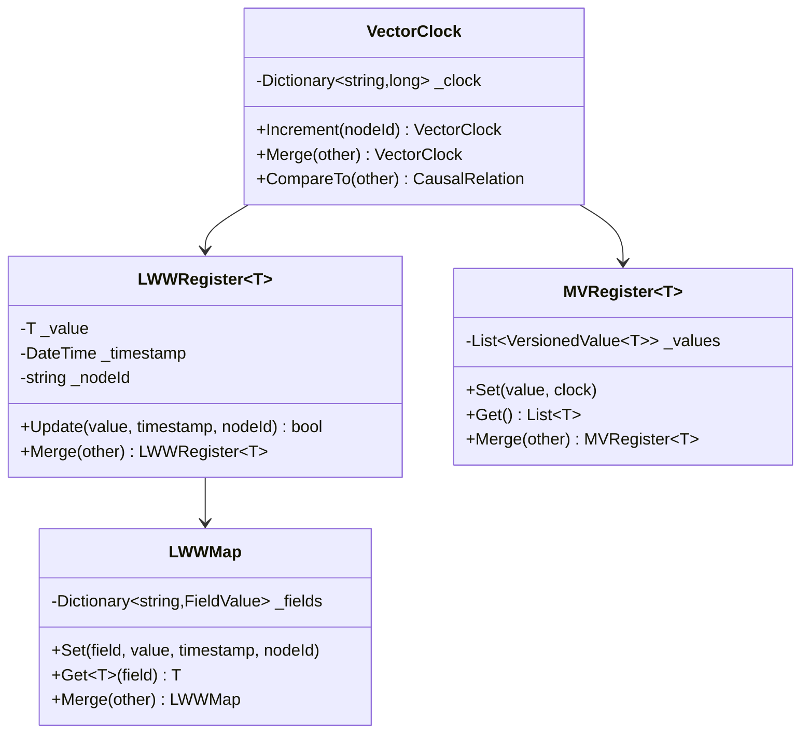
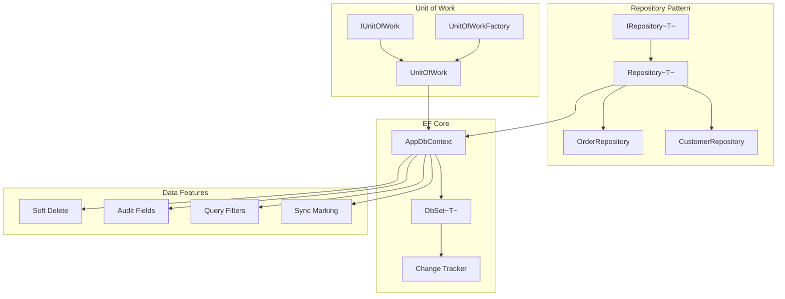

# Arcana Windows

A **Local-First, Plugin-Everything** Windows desktop application built with WinUI 3 and .NET 10.0. Designed for offline-capable business operations with CRDT-based synchronization and a comprehensive plugin architecture.

[](https://dotnet.microsoft.com/)
[](https://microsoft.github.io/microsoft-ui-xaml/)
[](https://docs.microsoft.com/dotnet/csharp/)
[](https://visualstudio.microsoft.com/)
[](LICENSE)
[]()

---

## Architecture Evaluation

### Overall Rating: 8.75/10 ⭐⭐⭐⭐⭐

| Category | Score | Description |
|----------|-------|-------------|
| **Clean Architecture** | 9.0/10 | Excellent layer separation, no circular dependencies, interface-driven |
| **Scalability** | 7.5/10 | Local-first design, sync server pending implementation |
| **Extensibility** | 9.5/10 | 18 plugin types, rich plugin context, assembly isolation |
| **Security** | 9.0/10 | PBKDF2-SHA256 (100k iterations), RBAC, account lockout, audit logs |
| **Testing** | 8.5/10 | 352 tests, xUnit + FluentAssertions, integration coverage |
| **Modern Stack** | 9.0/10 | .NET 10.0, C# 14, WinUI 3, EF Core 10 |
| **Data Patterns** | 9.0/10 | Repository, Unit of Work, CRDT, soft-delete, audit trails |
| **Configuration** | 8.5/10 | Serilog, appsettings.json, per-feature configuration |
| **Resilience** | 8.5/10 | Offline-first, conflict resolution, vector clocks |
| **Documentation** | 8.5/10 | XML docs, code examples, clear structure |

---

## Architecture Diagram



---

## Key Features Mind Map



---

## Layer Architecture

```
┌─────────────────────────────────────────────────────────────────────────────┐
│                              PRESENTATION LAYER                              │
│  ┌─────────────────────────────────────────────────────────────────────────┐│
│  │                         Arcana.App (WinUI 3)                            ││
│  │  ┌──────────────┐ ┌──────────────┐ ┌──────────────┐ ┌──────────────┐   ││
│  │  │   Views      │ │  ViewModels  │ │   Plugins    │ │   Services   │   ││
│  │  │  (XAML)      │ │  (MVVM)      │ │  (Built-in)  │ │  (Platform)  │   ││
│  │  └──────────────┘ └──────────────┘ └──────────────┘ └──────────────┘   ││
│  └─────────────────────────────────────────────────────────────────────────┘│
├─────────────────────────────────────────────────────────────────────────────┤
│                            INFRASTRUCTURE LAYER                              │
│  ┌─────────────────────────────────────────────────────────────────────────┐│
│  │                      Arcana.Infrastructure                              ││
│  │  ┌──────────────┐ ┌──────────────┐ ┌──────────────┐ ┌──────────────┐   ││
│  │  │  DI Setup    │ │  Security    │ │  Settings    │ │  Platform    │   ││
│  │  │  (Services)  │ │  (Auth)      │ │  (Config)    │ │  (Network)   │   ││
│  │  └──────────────┘ └──────────────┘ └──────────────┘ └──────────────┘   ││
│  └─────────────────────────────────────────────────────────────────────────┘│
├─────────────────────────────────────────────────────────────────────────────┤
│                              PLUGIN LAYER                                    │
│  ┌────────────────────────────────┐ ┌──────────────────────────────────────┐│
│  │   Arcana.Plugins.Contracts     │ │         Arcana.Plugins               ││
│  │  ┌─────────┐ ┌───────────────┐ │ │  ┌─────────┐ ┌──────────────────┐   ││
│  │  │ IPlugin │ │ 18 Plugin     │ │ │  │ Plugin  │ │ Plugin Services  │   ││
│  │  │ Types   │ │ Interfaces    │ │ │  │ Manager │ │ (Bus,Events,etc) │   ││
│  │  └─────────┘ └───────────────┘ │ │  └─────────┘ └──────────────────┘   ││
│  └────────────────────────────────┘ └──────────────────────────────────────┘│
├─────────────────────────────────────────────────────────────────────────────┤
│                               DOMAIN LAYER                                   │
│  ┌─────────────────────────────────────────────────────────────────────────┐│
│  │                          Arcana.Domain                                  ││
│  │  ┌──────────────┐ ┌──────────────┐ ┌──────────────┐ ┌──────────────┐   ││
│  │  │  Entities    │ │  Identity    │ │  Services    │ │  Validators  │   ││
│  │  │  (Business)  │ │  (Auth)      │ │  (Logic)     │ │  (Rules)     │   ││
│  │  └──────────────┘ └──────────────┘ └──────────────┘ └──────────────┘   ││
│  └─────────────────────────────────────────────────────────────────────────┘│
├─────────────────────────────────────────────────────────────────────────────┤
│                                DATA LAYER                                    │
│  ┌────────────────────────────────┐ ┌──────────────────────────────────────┐│
│  │         Arcana.Data            │ │           Arcana.Sync                ││
│  │  ┌─────────┐ ┌───────────────┐ │ │  ┌─────────┐ ┌──────────────────┐   ││
│  │  │ Repos   │ │ Unit of Work  │ │ │  │ CRDT    │ │ Conflict         │   ││
│  │  │ (EF)    │ │ (Transactions)│ │ │  │ Engine  │ │ Resolution       │   ││
│  │  └─────────┘ └───────────────┘ │ │  └─────────┘ └──────────────────┘   ││
│  └────────────────────────────────┘ └──────────────────────────────────────┘│
├─────────────────────────────────────────────────────────────────────────────┤
│                                CORE LAYER                                    │
│  ┌─────────────────────────────────────────────────────────────────────────┐│
│  │                           Arcana.Core                                   ││
│  │  ┌──────────────┐ ┌──────────────┐ ┌──────────────┐ ┌──────────────┐   ││
│  │  │ Interfaces   │ │ Result<T>    │ │ AppError     │ │ Base Types   │   ││
│  │  │ (Contracts)  │ │ (Railway)    │ │ (Errors)     │ │ (Entities)   │   ││
│  │  └──────────────┘ └──────────────┘ └──────────────┘ └──────────────┘   ││
│  └─────────────────────────────────────────────────────────────────────────┘│
└─────────────────────────────────────────────────────────────────────────────┘
```

---

## Plugin System Architecture



### Plugin Lifecycle



---

## Security Architecture



### Security Features

| Feature | Implementation | Details |
|---------|---------------|---------|
| **Password Hashing** | PBKDF2-SHA256 | 100,000 iterations, 128-bit salt, 256-bit hash |
| **Account Lockout** | After 5 attempts | 15-minute lockout duration |
| **Token Auth** | HMAC-SHA256 | Configurable expiry, refresh token rotation |
| **RBAC** | Role + Permission | User → Role → Permission hierarchy |
| **Direct Permissions** | Grant/Deny | Per-user permission overrides |
| **Audit Logging** | All auth events | Login, logout, password change, access denied |
| **Password Rehash** | Automatic | Upgrades when algorithm parameters change |

---

## CRDT Sync System



### Conflict Resolution Strategies

| Strategy | Description | Use Case |
|----------|-------------|----------|
| **LastWriterWins** | Latest timestamp wins | Default for most entities |
| **FirstWriterWins** | Original value preserved | Immutable fields |
| **FieldLevelMerge** | Per-field LWW | Complex entities |
| **KeepBoth** | Store both versions | Manual resolution needed |
| **Custom** | User-defined logic | Business-specific rules |

### CRDT Types



---

## Data Layer Architecture



### Entity Features

| Feature | Implementation | Fields |
|---------|---------------|--------|
| **Soft Delete** | Query Filters | `IsDeleted`, `DeletedAt`, `DeletedBy` |
| **Audit Trail** | SaveChanges Override | `CreatedAt`, `CreatedBy`, `ModifiedAt`, `ModifiedBy` |
| **Sync Support** | ISyncable Interface | `SyncId`, `LastSyncAt`, `IsPendingSync` |
| **Concurrency** | RowVersion | `RowVersion` (byte array) |

---

## Project Structure

```
arcana-windows/
├── src/
│   ├── Arcana.Core/                    # Foundation layer
│   │   ├── Common/                     # Base types, Result<T>, AppError
│   │   └── Security/                   # Auth interfaces
│   │
│   ├── Arcana.Domain/                  # Business layer
│   │   ├── Entities/                   # Order, Customer, Product
│   │   │   └── Identity/               # User, Role, Permission
│   │   ├── Services/                   # Domain services
│   │   └── Validation/                 # FluentValidation rules
│   │
│   ├── Arcana.Data/                    # Data access layer
│   │   ├── Local/                      # AppDbContext
│   │   └── Repository/                 # Repository + UoW
│   │
│   ├── Arcana.Sync/                    # Sync engine
│   │   ├── Crdt/                       # VectorClock, LWW, MV
│   │   └── Services/                   # SyncService
│   │
│   ├── Arcana.Plugins.Contracts/       # Plugin interfaces
│   │   └── *.cs                        # 18 plugin type contracts
│   │
│   ├── Arcana.Plugins/                 # Plugin runtime
│   │   ├── Core/                       # PluginManager, PluginBase
│   │   └── Services/                   # MessageBus, Events, etc.
│   │
│   ├── Arcana.Infrastructure/          # Cross-cutting concerns
│   │   ├── DependencyInjection/        # Service registration
│   │   ├── Security/                   # Auth implementations
│   │   └── Services/                   # Infrastructure services
│   │
│   └── Arcana.App/                     # WinUI 3 application
│       ├── Views/                      # XAML views
│       ├── ViewModels/                 # MVVM view models
│       ├── Plugins/                    # Built-in plugins
│       └── Services/                   # Platform services
│
└── tests/
    ├── Arcana.Domain.Tests/            # 12 tests
    ├── Arcana.Data.Tests/              # 9 tests
    ├── Arcana.Sync.Tests/              # 120 tests
    └── Arcana.Plugins.Tests/           # 211 tests
                                        # Total: 352 tests
```

---

## Technology Stack

| Layer | Technology | Version |
|-------|------------|---------|
| **Runtime** | .NET | 10.0 |
| **Language** | C# | 14.0 |
| **UI Framework** | WinUI 3 | Windows App SDK 1.5 |
| **MVVM** | CommunityToolkit.Mvvm | 8.2.2 |
| **Database** | SQLite via EF Core | 10.0 |
| **Validation** | FluentValidation | 11.9 |
| **Logging** | Serilog | 4.2 |
| **Testing** | xUnit | 2.7.0 |
| **Assertions** | FluentAssertions | 6.12.0 |
| **Mocking** | Moq | 4.20.70 |

---

## Requirements

- Windows 10 version 1809 (build 17763) or later
- [.NET 10.0 SDK](https://dotnet.microsoft.com/download/dotnet/10.0)
- Visual Studio 2026 (Version 18) with:
  - .NET Desktop Development workload
  - Windows App SDK

---

## Getting Started

### Clone & Build

```bash
git clone https://github.com/your-org/arcana-windows.git
cd arcana-windows
dotnet restore
dotnet build
```

### Run Tests

```bash
# All tests
dotnet test

# With coverage
dotnet test --collect:"XPlat Code Coverage"

# Specific project
dotnet test tests/Arcana.Sync.Tests
```

### Run Application

```bash
cd src/Arcana.App
dotnet run
```

---

## Code Examples

### Authentication

```csharp
// Login
var result = await _authService.AuthenticateAsync("admin", "password");
result.Match(
    success: auth => {
        // auth.AccessToken, auth.RefreshToken, auth.User
        _currentUserService.SetCurrentUser(auth.User);
    },
    failure: error => {
        // Handle AccountLocked, InvalidCredentials, etc.
        _logger.LogWarning("Login failed: {Error}", error.Message);
    }
);

// Check permission
if (_currentUserService.HasPermission(SystemPermissions.OrdersCreate))
{
    // User can create orders
}
```

### Plugin Development

```csharp
public class ReportPlugin : PluginBase
{
    public override PluginMetadata Metadata => new()
    {
        Id = "com.example.reports",
        Name = "Report Generator",
        Version = new Version(1, 0, 0),
        Type = PluginType.Module,
        Dependencies = new[] { "arcana.core.menu" }
    };

    protected override Task OnActivateAsync(IPluginContext context)
    {
        // Register menu item
        context.MenuRegistry.RegisterMenuItem(new MenuItemDefinition
        {
            Id = "reports-menu",
            Label = "Reports",
            Location = MenuLocation.MainMenu,
            Icon = "ReportDocument"
        });

        // Subscribe to events
        context.EventAggregator.Subscribe<OrderCreatedEvent>(OnOrderCreated);

        // Share state
        context.SharedStateStore.Set("reports.count", 0);

        return Task.CompletedTask;
    }

    private void OnOrderCreated(OrderCreatedEvent e)
    {
        // Handle order created event
    }
}
```

### Repository & Unit of Work

```csharp
// Transaction with Unit of Work
using var uow = _unitOfWorkFactory.Create();

var orders = uow.GetRepository<Order>();
var customers = uow.GetRepository<Customer>();

var customer = await customers.GetByIdAsync(customerId);
var order = new Order
{
    CustomerId = customer.Id,
    CustomerName = customer.Name,
    OrderDate = DateTime.UtcNow
};

await orders.AddAsync(order);
await uow.CommitAsync(); // Single transaction
```

### CRDT Conflict Resolution

```csharp
// Configure resolver
var resolver = new ConflictResolver();
resolver.Configure<Order>(ResolutionStrategy.FieldLevelMerge);
resolver.ConfigureCustom<Customer>((local, remote) => {
    // Business logic: prefer customer with more orders
    return local.OrderCount >= remote.OrderCount ? local : remote;
});

// Resolve conflict
var result = resolver.Resolve(
    localVersion,
    remoteVersion,
    localClock,
    remoteClock
);
```

---

## Built-in Modules

| Module | Description |
|--------|-------------|
| **Order Management** | Create, edit, search orders with line items |
| **Customer Management** | Customer master data, credit limits |
| **Product Management** | Product catalog with categories |
| **Plugin Manager** | Install, activate, configure plugins |
| **Settings** | Theme selection, language settings, sync configuration |
| **User Management** | Users, roles, permissions |

---

## Internationalization (i18n)

The application supports multiple languages with a plugin-based localization system.

### Supported Languages

| Language | Code | Status |
|----------|------|--------|
| English | `en-US` | Default fallback |
| Traditional Chinese | `zh-TW` | Full support |
| Japanese | `ja-JP` | Full support |

### Language Detection

1. On first launch, detects system UI language
2. Falls back to English if system language is not supported
3. User preference is persisted across sessions

### Plugin Localization

Each plugin can register its own language resources:

```csharp
protected override Task OnActivateAsync(IPluginContext context)
{
    RegisterPluginResources();
    return Task.CompletedTask;
}

private void RegisterPluginResources()
{
    RegisterResources("en-US", new Dictionary<string, string>
    {
        ["my.key"] = "English text"
    });
    RegisterResources("zh-TW", new Dictionary<string, string>
    {
        ["my.key"] = "中文文字"
    });
}
```

---

## Theme System

The application includes 9 built-in themes with support for custom color schemes.

### Available Themes

| Theme | Base | Description |
|-------|------|-------------|
| **System** | Auto | Follows Windows system theme |
| **Light** | Light | Clean white interface |
| **Dark** | Dark | Dark mode for low-light environments |
| **Ocean Blue** | Light | Blue accent with gradient |
| **Forest Green** | Light | Nature-inspired green palette |
| **Purple Night** | Dark | Deep purple with vibrant accents |
| **Sunset Orange** | Light | Warm orange and yellow tones |
| **Rose Pink** | Light | Soft pink feminine theme |
| **Midnight Blue** | Dark | Professional dark blue |

### Theme Persistence

- Theme selection is saved to `%LocalAppData%\Arcana\settings.json`
- Applied automatically on application startup
- Changes apply immediately to all open tabs

---

## Configuration

### appsettings.json

```json
{
  "Serilog": {
    "MinimumLevel": {
      "Default": "Information",
      "Override": {
        "Microsoft": "Warning",
        "System": "Warning"
      }
    }
  },
  "Security": {
    "Token": {
      "AccessTokenLifetime": "01:00:00",
      "RefreshTokenLifetime": "7.00:00:00"
    }
  },
  "Sync": {
    "AutoSyncInterval": 300,
    "RetryAttempts": 3
  }
}
```

### Data Locations

| Type | Path |
|------|------|
| **Database** | `%LocalAppData%/Arcana/data/arcana.db` |
| **Settings** | `%LocalAppData%/Arcana/settings.json` |
| **Logs** | `%LocalAppData%/Arcana/logs/app-*.log` |
| **Plugins** | `{AppDir}/plugins/` |

---

## Roadmap

- [ ] Sync server implementation (REST/gRPC)
- [ ] Plugin marketplace
- [ ] Report designer plugin
- [x] Multi-language support (i18n) - **Completed**
- [x] Theme system with 9 themes - **Completed**
- [ ] Backup/restore functionality
- [ ] Mobile companion app (MAUI)
- [ ] Cloud sync option

---

## Development

### Adding a New Entity

1. Create entity in `Arcana.Domain/Entities/`
2. Add DbSet in `Arcana.Data/Local/AppDbContext.cs`
3. Configure entity in `OnModelCreating()`
4. Create repository interface and implementation
5. Add FluentValidation validator
6. Create domain service
7. Register in `ServiceCollectionExtensions`

### Creating a Plugin

1. Create class library targeting `net10.0`
2. Reference `Arcana.Plugins.Contracts`
3. Inherit from `PluginBase`
4. Override `Metadata` and `OnActivateAsync`
5. Build and copy to `plugins/` directory

---

## License

This project is licensed under the MIT License - see the [LICENSE](LICENSE) file for details.

---

## Acknowledgments

- [Windows App SDK](https://github.com/microsoft/WindowsAppSDK)
- [CommunityToolkit](https://github.com/CommunityToolkit)
- [FluentValidation](https://github.com/FluentValidation/FluentValidation)
- [Serilog](https://github.com/serilog/serilog)
